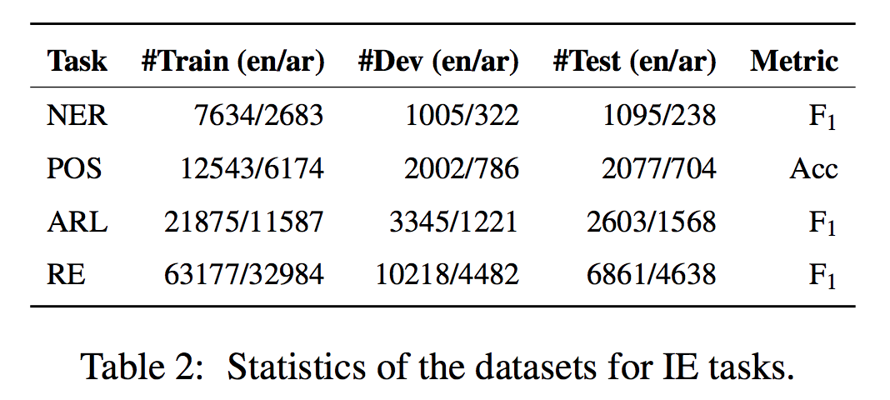

## GigaBERT
This repo contains pre-trained models and code-switched data generation script for [GigaBERT](https://arxiv.org/pdf/2004.14519.pdf):

	@inproceedings{lan2020gigabert,
	  author     = {Lan, Wuwei and Chen, Yang and Xu, Wei and Ritter, Alan},
  	  title      = {An Empirical Study of Pre-trained Transformers for Arabic Information Extraction},
  	  booktitle  = {Proceedings of The 2020 Conference on Empirical Methods on Natural Language Processing (EMNLP)},
  	  year       = {2020}
  	} 

## Fine-tuning Experiments
Please check [Yang Chen](https://github.com/edchengg/GigaBERT)'s GitHub for code and data.

  
   

## Checkpoints
The pre-trained models can be found here: [GigaBERT-v3](https://drive.google.com/drive/folders/1zgUXz8FQPHmWVNR7tHyPq1E6SmrMuPv6?usp=sharing) and [GigaBERT-v4](https://drive.google.com/drive/folders/1uFGzMuTOD7iNsmKQYp_zVuvsJwOaIdar?usp=sharing) 

Please contact [Wuwei Lan](lan.105@osu.edu) for code-switched GigaBERT with different configurations.

## License
Apache License 2.0

## Acknowledgement
This material is based in part on research sponsored by IARPA via the BETTER program (2019-19051600004).
